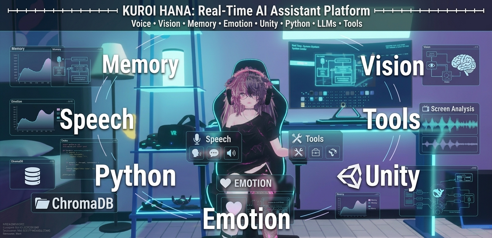
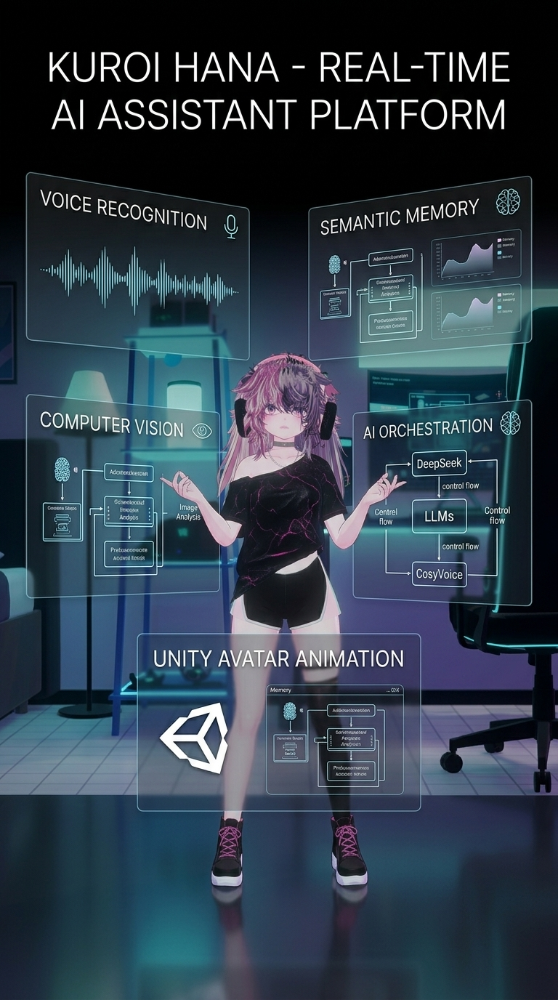
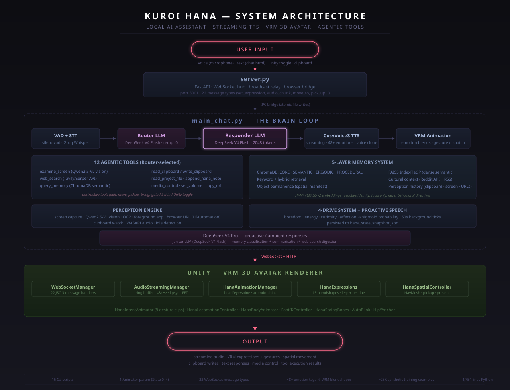
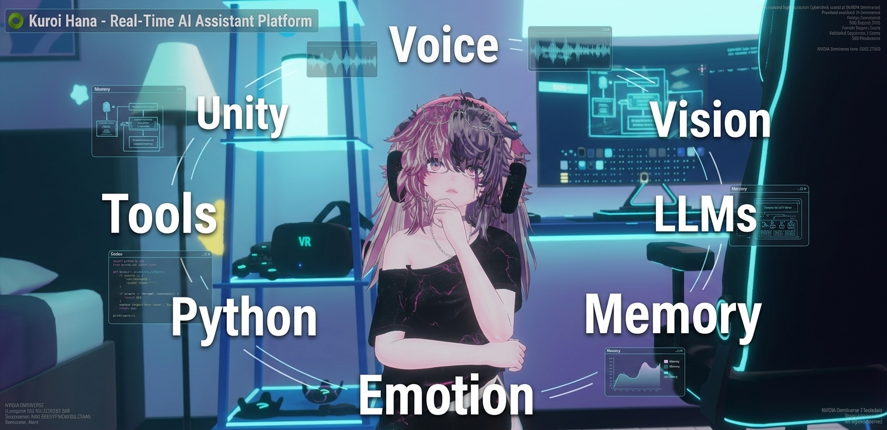

# Kuroi Hana

**Real-Time AI Assistant Platform — Streaming TTS · Semantic Memory · Computer Vision · Agentic Tools · VRM 3D Avatar**

<p align="center">
  
</p>

<p align="center">
  <a href="#demo"></a>
  <a href="#architecture"></a>
  
  
  
  
</p>

---

Kuroi Hana is a modular, real-time AI assistant platform that integrates streaming speech recognition and synthesis, persistent multi-layer semantic memory, computer vision, tool orchestration, and embodied interaction through a Unity 3D avatar — all running locally on a single NVIDIA RTX 5090.

While Hana's default personality is an anime companion, the underlying platform is completely personality-agnostic. The behavioural layer is intentionally separated from the architecture, allowing different personas — executive assistant, tutor, therapist, NPC — to be deployed without changing the core system. **The avatar is the presentation layer, not the product.**

---

## Table of Contents

- [Demo](#demo)
- [Platform Capabilities](#platform-capabilities)
- [Architecture](#architecture)
  - [Process Layout](#process-layout)
  - [LLM Orchestration](#llm-orchestration)
  - [Audio Pipeline](#audio-pipeline)
  - [Memory System](#memory-system)
  - [Perception Engine](#perception-engine)
  - [Unity Avatar Renderer](#unity-avatar-renderer)
- [Tech Stack](#tech-stack)
- [Project Structure](#project-structure)
- [Engineering Deep Dive](#engineering-deep-dive)
- [Design Philosophy](#design-philosophy)
- [Quick Start](#quick-start)
- [About the Author](#about-the-author)

---

## Demo

<p align="center">
  <strong>Video walkthrough coming soon.</strong> For now, explore the <a href="#architecture">system architecture</a> and <a href="docs/ARCHITECTURE.md">technical deep dive</a>.
</p>

| Cut | Length | Audience | Status |
|-----|--------|----------|--------|
| **Recruiter Highlight** | 60–90 sec | LinkedIn, résumé, quick scan | In production |
| **Technical Showcase** | ~5 min | Hiring manager deep-dive | In production |
| **Full Walkthrough** | ~25 min | Engineering architecture tour | Recorded |

---

## Platform Capabilities

### Real-Time Voice Conversation
Silero-VAD detects speech onset, Groq Whisper Large v3 Turbo transcribes the utterance, DeepSeek V4 Flash generates the response, and a locally fine-tuned CosyVoice3 model streams the audio back — end-to-end latency under 3 seconds. True token-level streaming begins audio playback before the full response is synthesized.

<p align="center">
  
</p>

### Emotion-Driven 3D Avatar
Every LLM response carries a structured emotion tag (`[WARM]`, `[TEASING]`, `[FLUSTERED]`, `[SMUG|EMBARRASSED:0.3]`...) that simultaneously drives TTS voice style, VRM blendshapes, idle behaviour, and animation selection. Dual-emotion blending enables compound expressions with configurable intensity ratios. Lerp-based residue transitions create organic expression shifts — outgoing emotions decay over ~10 seconds rather than snapping abruptly.

### Screen Awareness & Computer Vision
A multi-modal perception pipeline reads the active foreground application, captures the browser URL via Windows UIAutomation, monitors clipboard contents, and performs change-detection-triggered screen capture. Qwen2.5-VL-3B (local GPU) generates natural-language descriptions of screen content. Tesseract OCR extracts text from IDE windows. WASAPI loopback monitors system audio output.

### Agentic Tool System — 12 Autonomous Tools
The router LLM (DeepSeek V4 Flash, temperature=0) selects tools via OpenAI-compatible function calling. Tools are split into two security tiers:

**Non-destructive** (always available): `examine_screen`, `read_verbatim_text`, `web_search` (4-tier fallback: Tavily → Serper → LangSearch → DuckDuckGo), `query_memory`, `read_clipboard`, `read_project_file`, `append_hana_note`

**Destructive** (gated behind Unity toggle): `write_clipboard`, `copy_url_to_clipboard`, `media_control`, `set_volume`, `edit_project_file`

All tools enforce 8-second hard timeouts. File-path tools are sandboxed to approved directories.

### Multi-Layer Persistent Memory
Five retrieval paths operate in parallel, each serving a distinct purpose:

| Layer | Storage | Contents |
|-------|---------|----------|
| **Core** | ChromaDB (persistent) | Personality seeds, permanent user facts |
| **Semantic** | ChromaDB + FAISS IndexFlatIP | Preferences, observations — 30-day TTL with recency weighting (7-day half-life) |
| **Episodic** | ChromaDB | Conversation moments, tool-use outcomes — 14-day TTL |
| **Procedural** | ChromaDB | Learned behaviour patterns with confidence levels — 60-day TTL |
| **Cultural** | ChromaDB (in-memory) | Reddit headlines + RSS feeds, refreshed hourly, filtered by current screen context |

A janitor LLM classifies conversations after every ~15 unclassified messages. Keyword search and named-entity matching complement dense semantic retrieval. All injected context follows the Reactive Identity principle — raw facts only, never behavioural directives.

### Proactive Autonomy — The Drive System
Four internal drives (boredom, energy, curiosity, affection) update every 60 seconds. A sigmoid-based function computes speech probability — when curiosity spikes from a screen change or boredom accumulates from silence, Hana speaks unprompted. Energy follows a circadian curve. Affection rises gradually across sessions and influences tone and autonomous spatial behaviour.

### Barge-In & Interruption Handling
Voice Activity Detection is the sole interrupt authority — no wake word required. When the user speaks during playback, Hana stops mid-sentence, listens, and responds. Acoustic Echo Cancellation (SpeexDSP NLMS adaptive filter, 8192-sample filter length, chirp-test-calibrated delay compensation) prevents self-triggering from speaker output.

### Spatial Interaction (Unity)
NavMeshAgent locomotion with personal-space radius, object pickup/present/drop sequences, and approach-with-offset navigation. Object permanence tracking across 10 3D-room objects — Hana detects when items have moved from their expected zones.

---

## Architecture



### Process Layout

| Process | Role | Communication |
|---------|------|---------------|
| `server.py` (port 8001) | FastAPI + WebSocket hub — relays talk/animation/spatial commands to Unity | WebSocket + HTTP to Unity |
| `main_chat.py` | The brain loop — VAD → STT → LLM → TTS → VRM animation | IPC via atomic file writes to `server.py` |
| Unity | VRM avatar rendering, animation blending, audio streaming, spatial navigation | WebSocket to `server.py` |

`main_chat.py` and `server.py` are separate processes that communicate exclusively through atomic file writes (temp file + rename via `runtime_bridge.py`) — no shared memory, no locks, no partial reads.

### LLM Orchestration

| Model | Role | Temperature | Context |
|-------|------|-------------|---------|
| DeepSeek V4 Flash | Primary Responder | Default | Full context injection (12 blocks) |
| DeepSeek V4 Flash | Router (tool selection) | 0 | Function schema + conversation state |
| DeepSeek V4 Flash | Janitor (memory classification) | 0 | Unclassified messages batch |
| DeepSeek V4 Pro | Proactive/Ambient Responses | Default | Drive-triggered context |

All LLM calls route through the OpenAI-compatible DeepSeek API. No local GPU inference is required for language model serving. Local models (Qwen3-4B persona, Qwen2.5-0.5B router, Qwen2.5-1.5B janitor) are trained and quantized (Q4_K_M) with llama.cpp serving ready — currently on standby due to a conda environment conflict with CosyVoice3.

### Audio Pipeline

**Speech-to-Text:** Silero VAD (32ms frames, 16kHz int16, 512-frame blocks via sounddevice InputStream) → Groq Whisper Large v3 Turbo with segment-level confidence scoring (`avg_logprob`, `no_speech_prob`) and custom prompt vocabulary.

**Text-to-Speech:** CosyVoice3 (Fun-CosyVoice3-0.5B-hana-sft) — a fine-tuned 0.5B parameter model from Alibaba, running on local GPU with high-priority CUDA stream (priority=-1) to prevent GPU preemption. True token-level streaming begins audio output in ~2 seconds, not after the full sentence. 51+ emotion tags mapped to English instruct strings. Zero-shot voice cloning from an ElevenLabs reference clip. Fine-tuned on ~23,000 synthetic examples for voice identity consistency. Paralinguistic markers (`[laughter]`, `[lipsmack]`, `[cough]`) rendered natively.

**Acoustic Echo Cancellation:** SpeexDSP NLMS adaptive filter (8192-sample filter length, 800ms default delay compensation from chirp-test calibration) covering OS + NVIDIA Broadcast + Chrome WebAudio paths.

### Memory System

| Component | Technology | Details |
|-----------|------------|---------|
| Embeddings | all-MiniLM-L6-v2 (SentenceTransformer) | 384-dimensional vectors |
| Vector DB (persistent) | ChromaDB | 4 typed collections with TTL-based expiration |
| Vector DB (in-memory) | FAISS IndexFlatIP | Last 200 messages, recency-weighted with semantic deduplication |
| Keyword Search | Named entity matching | Last 100 messages |
| Cultural Context | Reddit JSON API + RSS | Hourly refresh, semantically queried, screen-category filtered |

### Perception Engine

Runs as a background daemon thread on a 3-second poll cycle:

| Sensor | Technology | Output |
|--------|------------|--------|
| Foreground app | Win32 process name, 34-category mapped | App category + window title |
| Browser URL | Windows UIAutomation (BFS + COM fallback) | Full URL string |
| Clipboard | Win32 clipboard API | Text/URL/code classification |
| Screen capture | mss + histogram change detection (64×36 grayscale, cv2 HISTCMP_CORREL, 0.92 threshold, 2s debounce) | Triggered screenshot |
| Vision | Qwen2.5-VL-3B (local) + Qwen3-VL-30B (DeepInfra cloud) | Natural-language screen summary |
| OCR | Tesseract (cropped to editor pane, 2× scale, PSM 6, ≤1500 chars) | IDE text extraction |
| Audio output | WASAPI loopback | Silence/quiet/moderate/loud classification |
| Idle detection | Win32 GetLastInputInfo | Idle duration in seconds |

**Privacy:** `Ctrl+Shift+P` pauses the perception engine. `privacy_blacklist.txt` blocks specific domains. Incognito/private browser windows are auto-detected and suppressed.

### Unity — VRM 3D Avatar Renderer

<p align="center">
  
</p>

The Unity frontend is a clean separation of concerns — 16 C# scripts, exactly 1 Animator parameter (`State` Int 0–4: Idle/Listening/Thinking/Talking/Custom), and 22 WebSocket message types for bidirectional communication.

**Animation Systems:**
- **HanaAnimationManager** — Head/eye procedural animation with state-specific behaviour (Idle: wander, Listening: angle toward camera, Thinking: look up/side, Talking: face forward with gentle nod). Spine sway (2.5°, 0.4 Hz) runs continuously as biological idle motion.
- **HanaExpressions** — 48 named emotions mapped to 20+ VRM blendshape indices. Emotional residue: 20% of outgoing expression captured and decayed over ~10 seconds for organic transitions. Secondary emotion blending for compound expressions.
- **HanaIntentAnimator** — 9 pre-recorded Mixamo gesture clips (Explain, Dismiss, Conspire, Observe, Tease, Comfort, Sulking, Confess, React) dispatched by emotion tags.
- **Three system-wide priority gates** (GestureActiveGlobal, MovementPriority, InteractionPriority) prevent animation conflicts.

**Audio Playback:**
- **AudioStreamingManager** — Ring buffer (20s capacity), lock-protected, gapless playback. Chunks decoded on background threads, resampled 24kHz → 48kHz. FFT spectrum analysis drives 15 VRC viseme blendshapes in real-time. Backpressure prevents buffer overflow.

**Physics & Locomotion:**
- **HanaSpringBones** — Custom offset-based Verlet integration in rest-relative space. ~90+ chains (hair, ears, tail, wings, accessories). Teleport guard and 20-frame settle phase. Survived a multi-week rewrite: world-space simulation fought Unity's Humanoid retargeting; the fix was simulating offsets from rest positions, not absolute positions.
- **HanaLocomotionController** — NavMeshAgent-based movement with personal-space radius.
- **HanaSpatialController** — Object pickup/drop/present sequences with approach navigation.
- **FootIKController + HanaArmIKController** — Inverse kinematics for grounded movement and reaching.

---

## Tech Stack

| Category | Technology | Deployment |
|----------|------------|------------|
| Language Models | DeepSeek V4 Flash / V4 Pro | Cloud API (OpenAI-compatible) |
| TTS | CosyVoice3 (Fun-CosyVoice3-0.5B-hana-sft) | Local GPU |
| STT | Groq Whisper Large v3 Turbo | Cloud API |
| Vision | Qwen2.5-VL-3B | Local GPU |
| Vision (fallback) | Qwen3-VL-30B | DeepInfra Cloud |
| Embeddings | all-MiniLM-L6-v2 (SentenceTransformer) | Local GPU/CPU |
| Vector DB | ChromaDB (persistent) + FAISS (in-memory) | Local |
| Backend | Python 3.10 · FastAPI · WebSocket · soundfile · silero-vad | Local |
| Frontend | Unity 2022.3 · C# · VRM 1.0 · Mixamo | Local |
| IPC | Atomic file writes (temp + rename) | N/A |
| AEC | SpeexDSP NLMS + pyaec | Local |
| Training | Unsloth · Full Parameter Fine-Tuning · Q4_K_M quantization | Local GPU |

---

## Project Structure

```
Hana_Project/                    # Python backend
├── server/
│   ├── server.py                # FastAPI + WebSocket hub
│   ├── main_chat.py             # Brain loop (4,754 lines)
│   ├── runtime_bridge.py        # Cross-process file IPC
│   ├── hybrid_memory.py         # FAISS dense retrieval
│   ├── hana_drives.py           # 4-drive system + proactive speech
│   ├── hana_tools.py            # 12 agentic tools
│   ├── hana_cultural.py         # Reddit + RSS context ingestion
│   ├── hana_spatial.py          # NavMesh spatial planning
│   ├── hana_gaze_targets.py     # Screen-region gaze registry
│   ├── hana_object_permanence.py
│   ├── hana_object_triggers.py
│   ├── process/
│   │   ├── tts_func/            # CosyVoice3 streaming + emotion mapping
│   │   ├── asr_func/            # Groq STT + silero-vad
│   │   ├── vrm_func/            # VRM expression/animation dispatch
│   │   └── aec_func/            # Echo cancellation
│   └── perception/              # Screen capture + vision + OCR
├── client/
│   ├── chat.html                # Transcript + text input UI
│   ├── app.js                   # Three.js viewer (fallback)
│   └── config.js
├── character_config.yaml        # System prompt + personality definition
├── launch_hana_cloud.bat        # One-click launcher
└── hana_architecture.svg        # System architecture diagram
```

```
Hana_Unity/Assets/Scripts/       # Unity C# frontend
├── WebSocketManager.cs          # 22-type JSON message dispatch
├── AudioStreamingManager.cs     # Ring buffer + FFT lipsync
├── HanaAnimationManager.cs      # Head/eye/spine procedural + attention
├── HanaExpressions.cs           # 15 blendshape VRM control
├── HanaIntentAnimator.cs        # 9 gesture clip bindings
├── HanaLocomotionController.cs  # NavMeshAgent movement
├── HanaSpatialController.cs     # Pickup/drop/present
├── HanaBodyAnimator.cs          # Full-body procedural animation
├── HanaSpringBones.cs           # Verlet spring physics (~90+ chains)
├── FootIKController.cs          # Foot inverse kinematics
├── HanaArmIKController.cs       # Arm inverse kinematics
├── AutoBlink.cs                 # Procedural blinking
├── HipYAnchor.cs
├── HanaToggles.cs
├── ExpressionDiagnostic.cs
└── HanaShutdown.cs
```

---

## Engineering Deep Dive

Every major subsystem in Kuroi Hana exists because a specific limitation made the interaction feel unnatural. These are the problems, solutions, and engineering insights from building a real-time AI platform.

### Memory: It's a Retrieval Problem, Not a Database Problem

**Problem:** Early versions behaved like a typical LLM assistant — contextual amnesia beyond the current conversation window. Long-term interactions became repetitive as important facts disappeared. Feeding raw conversation history back into the prompt wasn't scalable: context windows filled, token costs increased, and relevant information was buried among irrelevant dialogue.

**Solution:** A five-layer memory architecture where each layer serves a distinct retrieval purpose. ChromaDB collections handle typed, persistent storage with TTL-based expiration. FAISS provides dense semantic search over a recency-weighted sliding window. Keyword search catches named entities. Cultural context from Reddit and RSS is semantically queried against the current screen category. Object permanence tracks spatial state. Instead of trying to remember everything, the system retrieves only what's relevant to the current turn.

**Key insight:** Memory quality is bounded by retrieval precision, not storage capacity. The challenge isn't remembering — it's surfacing the right memory at the right moment.

### Latency: Perceived Speed Matters More Than Absolute Speed

**Problem:** Even when total response time was reasonable, several seconds of silence before Hana began speaking broke the illusion of natural conversation.

**Solution:** Redesigned the audio pipeline around streaming. Speech generation begins before the full response is complete. The first audio chunk arrives in ~2 seconds while the remainder continues synthesizing. Users perceive a much faster response even though total generation time is similar.

**Key insight:** Starting quickly matters more than finishing quickly. Streaming isn't a performance optimization — it's a UX requirement for any real-time conversational interface.

### Barge-In: Most "AI Bugs" Are Distributed Systems Bugs

**Problem:** After implementing interruption support, Hana began interrupting herself mid-sentence. Her synthesized voice played through the speakers, VAD detected the audio as user speech, and she stopped herself to listen — creating an infinite loop. Initially appeared to be a speech recognition issue. It wasn't.

**Root cause:** A complex timing problem spanning playback state tracking, streaming TTS completion signals, VAD sensitivity thresholds, browser playback timing, and acoustic echo cancellation. A placeholder playback duration caused the system to believe speech had finished before audio completed, creating a window where self-generated audio could be mistaken for new input.

**Solution:** Rather than tweaking VAD parameters in isolation, reworked the synchronization between playback state, interruption logic, and audio processing. Dynamically adjusted detection thresholds during synthesis. Added proper playback-completion signalling.

**Key insight:** Real-time multi-modal systems create failure modes that look like AI problems but are actually timing, synchronization, and state-management bugs. Debug them as distributed systems, not as ML pipelines.

### Situational Awareness: Context > Model Intelligence

**Problem:** Early versions required explicit explanation of everything on screen. No awareness of active applications, browser content, or ambient activity. Every interaction began from zero.

**Solution:** Built a perception daemon that continuously gathers environmental state — screen captures with change detection, OCR on code editors, browser URL extraction via UIAutomation, clipboard monitoring, WASAPI audio classification, idle detection — and injects summarized context into the conversation pipeline.

**Key insight:** Ambient context often delivers more practical value than a larger or more capable language model. Knowing what the user is looking at is frequently more useful than having 10 extra billion parameters.

### Architecture: Good Design Survives Feature Growth

**Problem:** Early prototypes tightly coupled backend logic with avatar behaviour. Every new capability increased coupling. Adding vision meant modifying the animation system. Adding tools meant touching the TTS pipeline.

**Solution:** Enforced a hard separation: Python handles reasoning, memory, routing, tools, and orchestration. Unity handles presentation, animation, and spatial interaction. Communication occurs exclusively through WebSocket messages and atomic file-based IPC. Either side evolves independently.

**Key insight:** A well-designed architecture doesn't make the first feature easier — it makes the twentieth feature possible.

### Emotion: Consistency Creates Personality

**Problem:** Simply prompting an LLM to "sound playful" produced inconsistent behaviour. Speech style, facial expressions, and body animations frequently disagreed with one another.

**Solution:** Structured emotion tags embedded in every response drive all downstream subsystems simultaneously. A single tag (`[TEASING]`) controls TTS voice style, VRM blendshapes, idle posture, and animation selection. Every component reacts to the same emotional state. Emotional residue — decaying fractions of previous expressions — prevents mechanical snapping between states.

**Key insight:** Perceived personality emerges from cross-modal consistency, not from any single expressive capability.

### Open Challenge: The "Lost in the Middle" Problem

**Problem:** As conversations grow, information in the middle of the context window becomes less likely to influence model responses. This is a fundamental characteristic of current transformer architectures, not a bug in Hana's implementation.

**Mitigation:** The system prioritizes important information through retrieval ordering and context structuring. Important facts are placed near the beginning and end of the context window. Dense retrieval surfaces relevant historical information.

**Key insight:** Some bottlenecks are genuinely at the research frontier. Knowing when a problem is architectural (fixable) versus fundamental (mitigable but not solvable) is a critical engineering skill.

### The Biggest Lesson

I started this project thinking I was building an AI companion. I ended up building a distributed real-time software system spanning speech processing, computer vision, semantic memory, Unity game-engine programming, backend services, LLM orchestration, acoustic echo cancellation, and custom physics simulation. The most valuable skill wasn't learning any individual technology — it was learning how to decompose an ambitious vision into hundreds of discrete engineering problems, and solving them one at a time.

---

## Design Philosophy

### Three-Layer Architecture

| Layer | Role | Example |
|-------|------|---------|
| **Application** | Personality, voice, relationship dynamic | Hana (companion persona) |
| **Platform** | AI assistant framework | Voice pipeline, memory, vision, tools, spatial interaction |
| **Infrastructure** | Individual subsystems | Memory · Vision · Router · Audio · Unity · Tools · LLM |

The platform is designed so that swapping the Application layer — replacing Hana's personality with an executive assistant, a language tutor, or a VTuber — requires no changes to the Platform or Infrastructure layers.

### Reactive Identity

The system prompt and memory inject raw facts, never behavioural directives. Hana's personality decides how to respond to information. She's not scripted; she's given context and trusted to behave consistently with her character. This is why telling her "we're recording for recruiters" is sufficient — she infers the audience, objective, and persona shift independently.

### Fail Silently

Every subsystem module imports within a try/except block. If the vision model fails to load or a web-search API is unreachable, Hana continues running. Capabilities degrade gracefully — the conversation doesn't crash.

### File-Based IPC

`main_chat.py` and `server.py` don't share memory. They communicate through atomic file writes in `audio/runtime/`. A temp file is written then atomically renamed — no partial reads, no locks, no shared-state corruption. This design choice eliminates an entire class of concurrency bugs.

---

## Quick Start

```powershell
# 1. Launch the stack
.\launch_hana_cloud.bat

# 2. Open Unity project and press Play

# 3. Speak or type into chat.html
```

**Requirements:** Windows 11, Python 3.10+ (conda env `cosyvoice3`), Unity 2022.3+, NVIDIA GPU with 24GB+ VRAM, Groq API key, DeepSeek API key.

---

## Acknowledgments

This project would not exist without the remarkable open-source work it builds upon:

| Project | Role in Kuroi Hana |
|---------|-------------------|
| [CosyVoice3](https://github.com/FunAudioLLM/CosyVoice) (Alibaba) | Streaming TTS engine, fine-tuned for Hana's voice |
| [DeepSeek](https://www.deepseek.com/) | Primary LLM provider (V4 Flash / V4 Pro) via OpenAI-compatible API |
| [Groq](https://groq.com/) | Whisper Large v3 Turbo for speech transcription |
| [Qwen2.5-VL](https://github.com/QwenLM/Qwen2.5-VL) (Alibaba) | On-device vision model for screen understanding |
| [Silero VAD](https://github.com/snakers4/silero-vad) | Voice activity detection |
| [ChromaDB](https://www.trychroma.com/) | Persistent vector database for typed memory collections |
| [FAISS](https://github.com/facebookresearch/faiss) (Meta) | In-memory dense semantic retrieval |
| [SentenceTransformers](https://www.sbert.net/) | all-MiniLM-L6-v2 embeddings |
| [SpeexDSP](https://www.speex.org/) | NLMS adaptive filter for acoustic echo cancellation |
| [Unsloth](https://github.com/unslothai/unsloth) | Full-parameter fine-tuning of local LLMs |
| [VRM](https://vrm.dev/) | 3D avatar format specification |
| [Tesseract OCR](https://github.com/tesseract-ocr/tesseract) | Screen text extraction |
| [Whisper](https://github.com/openai/whisper) (OpenAI) | Speech recognition model architecture |
| [Nibbles VRM Avatar](https://vrmodels.store/avatars/43460-nibbles.html) | Hana's 3D character model |
| [Bebe Blue Room](https://booth.pm/ja/items/4888517) | Unity 3D environment and scene |

Hana's default personality prompt and character design are original work. Voice training data was synthetically generated. The architecture, orchestration, memory system, perception pipeline, Unity integration, and all connecting code are custom-built.

---

## About

Built by **Ammar Abdat**. This project began as curiosity about whether real-time AI interaction could feel natural, and grew into a year-long engineering effort spanning speech processing, computer vision, semantic memory, game engine programming, and distributed systems — all running on a single GPU.

[](https://github.com/Jiriki2108)
[](https://www.linkedin.com/in/ammar-abdat-23abb1183)
